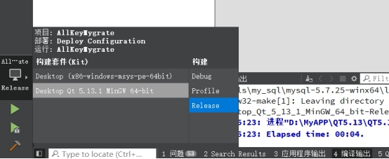
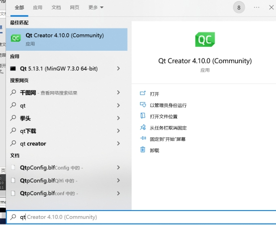
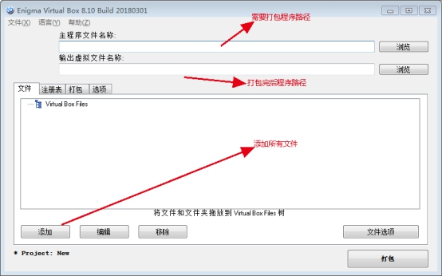
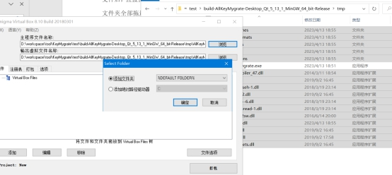

# other

## 设置控件是否可见

使用`.setVisible(bool)` 方法，例如：

```cpp
ui->radioButton->setVisible(false);
```


# 文本框

## 设置提示信息

使用 `.setPlaceholderText(tr(mess))` 方法。例如：

```cpp
ui->lineEdit->setPlaceholderText(str);
```

## 限制输入框格式

使用 `.setValidator()` 方法。例如：

```cpp
void PassWordEditWidget::setMaxInput(int max) {
    QString regExpStr;
    m_maxInput = max;
    switch (m_limitInputType) {
    case 1:
    	regExpStr = QString("[0-9]{1,%1}").arg(max);
        break;
    case 2:
        regExpStr = QString("[a-fA-F0-9]{1,%1}").arg(max);
        break;
    case 3:
        regExpStr = QString("[a-zA-Z0-9]{1,%1}").arg(max);
        break;
    case 4:
        regExpStr = QString(".{1,%1}").arg(m_maxInput);
        break;
    }
    QRegExp regExp_cpt(regExpStr);
    ui->lineEdit->setValidator(new QRegExpValidator(regExp_cpt, this));
}
```


# RadioButton

## 设置初始状态

使用 `.setChecked(bool)` 方法。例如：

```cpp
ui->radioButton->setChecked(true);    // 默认被选中
```


## 检查是否被选中

使用 `.isChecked()` 方法。例如：

```cpp
const int algID = ui->radioButton->isChecked() ? 1 : 0;
```


## 设置字体颜色

使用 `.setStyleSheet()` 方法。例如：

```cpp
ui->radioButton_certchain_n->setStyleSheet("QRadioButton { color: red; }"); // 设置字体颜色
```


# 表格

## 设置列数和标题

```cpp
FlatUI::setTableWidgetStyle(ui->tableWidget, 40);
ui->tableWidget->setEditTriggers(QAbstractItemView::DoubleClicked);
ui->tableWidget->setFocusPolicy(Qt::ClickFocus);
ui->tableWidget->setColumnCount(2); // 设置列数
// 设置列标题
ui->tableWidget->setHorizontalHeaderLabels({"索引", "SSL证书白名单—证书指纹SHA1"});
// 设置列自适应大写
ui->tableWidget->horizontalHeader()->setSectionResizeMode(QHeaderView::ResizeToContents);
// 最后一列拉满屏幕
ui->tableWidget->horizontalHeader()->setStretchLastSection(true);
```


## 右键菜单

```cpp
QObject::connect(ui->tableWidget, SIGNAL(customContextMenuRequested(QPoint)), this, SLOT(show_menu(QPoint)));

void CertWhiteListMng::show_menu(QPoint) {
    const int count = ui->tableWidget->rowCount();
    const int cursel = ui->tableWidget->currentRow();
    if (-1 == cursel) {
        return;
    }
    QMenu *menu_main = new QMenu(ui->tableWidget);
    QString itemname("删除SSL证书白名单");
    QAction *pitem_del = new QAction(itemname, menu_main);
    QObject::connect (pitem_del,SIGNAL(triggered()), this, SLOT(onClickDelWhiteList()));
    menu_main->addAction(pitem_del);
    const bool benable = (count-1 != cursel ? true : false);
    pitem_del->setEnabled(benable);

    QAction *pitem_refresh = new QAction(QString("刷新"), menu_main);
    QObject::connect (pitem_refresh,SIGNAL(triggered()), this, SLOT(GetCertWhiteList()));
    menu_main->addAction(pitem_refresh);

    menu_main->move(cursor().pos());
    menu_main->show();
}
```


# QDialog窗口

## 设置窗口名称

```cpp
// 设置窗口名称
this->setWindowTitle("SSL证书白名单管理");
// 设置固定大小, 不可拉伸
this->setFixedSize(1051, 610);
```


## 屏蔽右上角 ？

```cpp
setWindowFlags(windowFlags() & ~Qt::WindowContextHelpButtonHint);
    ui->pushButton_exit->setFixedSize(160, 44);
    ui->pushButton_exit->setText("退出");
    FlatUI::setPushButtonQss(ui->pushButton_exit, 10, 0, "#cccccc", "#585858", "#3CC3F4", "#FFFFFF", "#3CC3F4", "#FFFFFF");
```


## 屏蔽右上角最大化按钮

```cpp
setWindowFlags(windowFlags() & ~Qt::WindowMaximizeButtonHint);
```


# 进度条

```cpp
// 进度提示框
const int random = 1 + rand() % (9 - 1 + 1);
QApplication::setOverrideCursor(Qt::WaitCursor);    // 设置鼠标为转圈圈
QProgressDialog progress_dialog(this);				// 进度条框
progress_dialog.setCancelButtonText(nullptr); 		// 屏蔽cancel按钮
progress_dialog.setWindowTitle("设置认证模式");
progress_dialog.setLabelText("设置中, 请稍候...");	// 进度条变化时提示语
progress_dialog.setRange(0, 200 + random);			// 进度条范围
progress_dialog.setModal(true); 					// 设置为拟态
progress_dialog.setWindowFlags(progress_dialog.windowFlags() & ~Qt::WindowCloseButtonHint);         			   // 屏蔽右上角x按钮
progress_dialog.setWindowFlags(progress_dialog.windowFlags() & ~Qt::WindowContextHelpButtonHint);				   // 屏蔽右上角?按钮
progress_dialog.show();
for (int i = 0; i < 200; i++) {
    progress_dialog.setValue(i);
    std::this_thread::sleep_for(std::chrono::milliseconds(10));
    QCoreApplication::processEvents(); // 刷新进度条
}
const int verifymode = UnionSSLSettingFunc(GET_VERIFY_MODE, -1);
QApplication::restoreOverrideCursor(); // 取消鼠标转圈圈
progress_dialog.close();
```


# 打包流程

1. 打开QT程序，以release方式构建一次。操作如下图，点击锤子构建。



这时你的工程项目文件夹下，会生成一个关于release的文件夹。路径为项目概要中设置的路径：


2. 打开关于release相关的文件夹，找到该目录下release目录下的.exe程序。此时你点击是运行不成功的。因为缺少QT必要的库文件。将这个.exe文件拷贝出来，创建一个单独的文件夹，放在这个文件夹下。

3. 在windows下，搜索QT(也可以在qt程序目录下寻找)，如下图，打开qt命令行，Qt 5.13.1 (MinGW 7.3.0 64-bit)

    打开红色标记的命令窗口，接着输入命令行，cd /d 路径(指的是需要打包的exe程序目录，就是刚才拷贝出来的exe程序所在的目录)，回车后：

    输入如下命令行：windeployqt 程序名 敲击回车。这一步操作是将所需的库文件全都拷贝到exe程序的当前文件：

    此时，在当前目录下是可以点击运行exe程序的，但调用的自定义动态库和文件还不在其中，需要我们手动复制到该文件夹中。




4. 打开运行Enigma Virtual Box：



按照上图的示意(输出文件名可自定义)，添加路径和文件如下图。文件可以托选，选择所有文件后，直接拖入界面框内。注意把除了exe程序以外的所有文件和文件夹全部拖进。示意图如下：



点击确认后在文件选项中选择压缩文件：