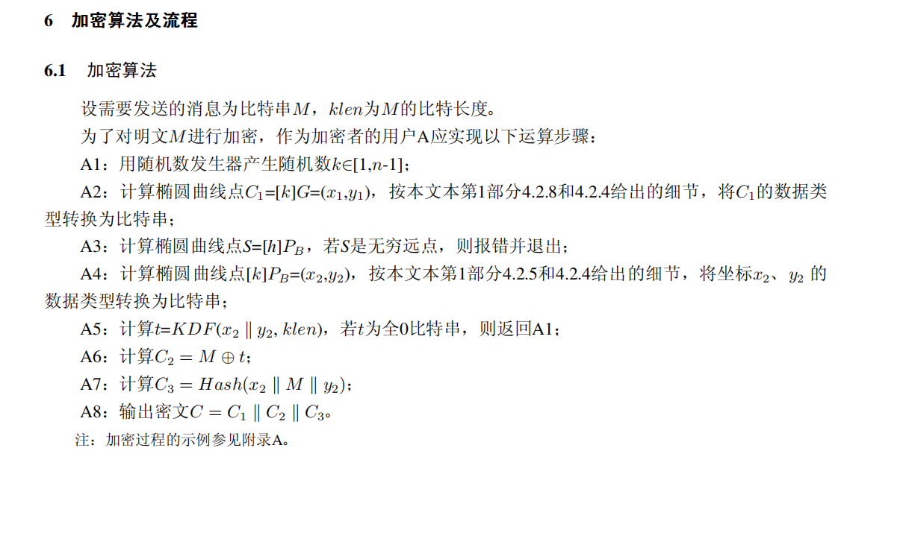
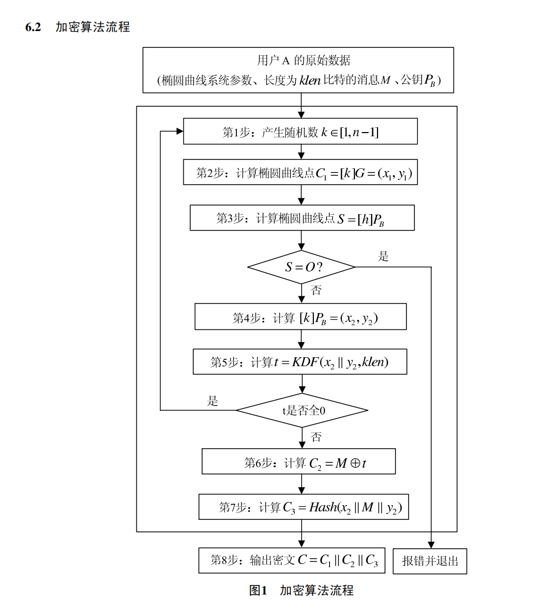
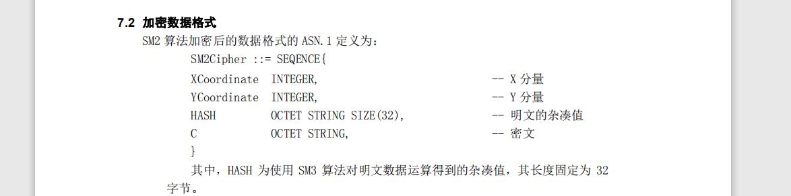

# 证书

## 证书指纹计算

对证书内容作一个sha1（或其他算法）计算。

如果证书是base64编码，不包含begin和end那两行，如果是二进制编码，用asn1工具打开，复制全部数据去算


# SSL

## 概念

1. SSL是一种用于在网联上保护信息安全的标准安全技术；它通过对网络连接进行加密来确保数据在客户端和服务端之间的安全传输。
2. SSL协议使用了**非对称加密和对称加密技术**，可以防止数据在传输过程中被窃取和篡改。
3. SSLCA证书和应用证书可以不在同一证书链上，CA证书用于验证对方应用证书的证书链。


## 工作原理

1. 握手阶段：客户端发起与服务器的连接请求，服务器会返回其SSL证书（服务端证书）。客户端验证证书的有效性（证书链、有效期、白名单...），并生成一个预主密钥，再用服务器的公钥加密后发送给服务器。
2. 密钥协商阶段：服务器接收到客户端发送的预主密钥后，使用自己的私钥解密得到预主密钥，然后双方基于预主密钥生成会话密钥（对称密钥），用于加密通信数据。
3. 数据传输阶段：客户端和服务器使用会话密钥进行加密和解密通信数据，确保数据在传输过程中的机密性和完整性。


## openssl生成证书

```sh
# 生成ca私钥
openssl genrsa -passout pass:12345678 -des3 -out ca.key 2048 

# 生成ca自签名证书
openssl req -passin pass:12345678 -new -x509 -days 3650 -key ca.key -out ca.crt -subj  "/C=SP/ST=Spain/L=Valdepenias/O=Test/OU=Test/CN=RootCA"

# 生成服务器私钥
openssl genrsa -passout pass:12345678 -des3 -out server.key 2048

# 生成服务器csr
openssl req -passin pass:12345678 -new -key server.key -out server.csr -subj  "/C=CN/ST=SSL/L=SERVER/O=Test/OU=Test/CN=SERVER"

# 签署服务器证书
openssl x509  -passin pass:12345678 -req -days 365 -in server.csr -CA ca.crt -CAkey ca.key -CAcreateserial -out server.crt -sha256

# 生成客户端私钥
openssl genrsa -passout pass:12345678 -des3 -out client.key 2048

# 生成客户端csr
openssl req -passin pass:12345678 -new -key client.key -out client.csr -subj  "/C=CN/ST=SSL/L=CLIENT/O=Test/OU=Test/CN=CLIENT"

# 签署客户端证书
openssl x509 -passin pass:12345678 -req -days 365 -in client.csr -CA ca.crt -CAkey ca.key -CAcreateserial -out client.crt -sha256
```


## 服务端源码

### 接口

```cpp
#include <openssl/ssl.h>
#include <openssl/err.h>

// SSL 库初始化 
SSL_library_init();
// 载入所有 SSL 算法 
OpenSSL_add_all_algorithms();
// 载入所有 SSL 错误消息
SSL_load_error_strings();

// 以 SSL V2 和 V3 标准兼容方式产生一个 SSL_CTX ，即 SSL Content Text
// fail: return NULL
SSL_CTX *ctx = SSL_CTX_new(SSLv23_server_method());

// 设置对对方证书的校验
SSL_CTX_set_verify(ctx, SSL_VERIFY_PEER|SSL_VERIFY_FAIL_IF_NO_PEER_CERT, SSLVerifyFunc);
// 经验证, 设置了SSL_CTX_set_cert_verify_callback函数后, SSL_CTX_set_verify函数失效。
SSL_CTX_set_cert_verify_callback(ctx, SSLVerifyCallBackFunc, 0);

// 加载Client-CA的证书
// fail: return <= 0
SSL_CTX_load_verify_locations(ctx, CA_CERT, NULL); 

// 加载自己的证书 - 服务端证书
// 用于发送给客户端
// fail: return <= 0
SSL_CTX_use_certificate_file(ctx, APP_CERT, SSL_FILETYPE_PEM);

// 设置私钥文件密码
SSL_CTX_set_default_passwd_cb_userdata(ctx, APP_KEY_PASSWD);

// 读取密钥文件 
// fail: return <= 0
SSL_CTX_use_PrivateKey_file(ctx, APP_KEY, SSL_FILETYPE_PEM);

//判定私钥是否正确 
// fail: return == 0
SSL_CTX_check_private_key(ctx);

/* 基于 ctx 产生一个新的 SSL */
// fail: return NULL
SSL *ssl = SSL_new(ctx);

/* 将连接用户的 socket 加入到 SSL, 这里是accept接收后的socket文件描述符 */
SSL_set_fd(ssl, fd);

/* 建立 SSL 连接 */
// fail: return == -1
SSL_accept(ssl);

// wrrite
SSL_write(ssl, buf, length);

// read
SSL_read(ssl, buf, length);
```


### 示例程序

1. 建立socket，绑定到某个端口，开启监听。
2. 产生一个 `SSL_CTX`，记为 `ctx`，类似于上下文或者句柄，并设置证书校验函数，ca证书、服务端证书以及私钥文件。
3. 将 `accpet` 接收产生的文件句柄记为 `fd`。
4. 基于 `ctx` 产生一个新的 SSL，记为 `ssl`，将 `fd` 和 `ssl` 相关联。
5. 使用 `SSL_accept` 函数建立 `ssl` 连接，此时会调用第二步设置的校验函数。
6. 使用 `SSL_write` 和 `SSL_read` 函数进行通讯。

```cpp
#include <string>

#include <cerrno>
#include <cstdlib>
#include <cstring>

#include <unistd.h>
#include <sys/wait.h>
#include <sys/types.h>
#include <sys/socket.h>
#include <arpa/inet.h>
#include <netinet/in.h>

#include <openssl/ssl.h>
#include <openssl/err.h>

constexpr std::uint16_t SRV_PORT = 7838;
constexpr char CA_CERT[] = "./cert/ca.crt";
constexpr char APP_CERT[] = "./cert/server.crt";
constexpr char APP_KEY[] = "./cert/server.key";
char APP_KEY_PASSWD[] = "12345678";

static inline int SSLVerifyFunc(int isok, X509_STORE_CTX *x509_ctx) {
    std::printf("in %s::%d:: isok = [%d].\n", __func__, __LINE__, isok);
    if (0 == isok) {
        return 0;
    }
    if (nullptr == x509_ctx) {
        return 0;
    }
    return 1;
}


static inline int SSLVerifyCallBackFunc(X509_STORE_CTX *x509_ctx, void *arg) {
    std::printf("in %s::%d:: \n", __func__, __LINE__);
    return 0;
}

// g++ -std=c++11 server.cpp -lssl -lcrypto -o server

int main() {
    // SSL 库初始化 
    SSL_library_init();
    // 载入所有 SSL 算法 
    OpenSSL_add_all_algorithms();
    // 载入所有 SSL 错误消息
    SSL_load_error_strings();

    int fd = -1;
    int sock = -1;
    SSL *ssl = nullptr;
    SSL_CTX *ctx = nullptr;

    do {
        // 以 SSL V2 和 V3 标准兼容方式产生一个 SSL_CTX ，即 SSL Content Text
        ctx = SSL_CTX_new(SSLv23_server_method());
        if (nullptr == ctx) {
            std::printf("in %s::%d::\n", __func__, __LINE__);
            ERR_print_errors_fp(stdout);
            break;
        }

        // 设置对对方证书的校验
        SSL_CTX_set_verify(ctx, SSL_VERIFY_PEER|SSL_VERIFY_FAIL_IF_NO_PEER_CERT, SSLVerifyFunc);
        // 经验证, 设置了SSL_CTX_set_cert_verify_callback函数后, SSL_CTX_set_verify函数失效。
		SSL_CTX_set_cert_verify_callback(ctx, SSLVerifyCallBackFunc, 0);

        // 加载Client-CA的证书
        if (SSL_CTX_load_verify_locations(ctx, CA_CERT, nullptr) <= 0) { //cert must pem
            std::printf("in %s::%d::\n", __func__, __LINE__);
            ERR_print_errors_fp(stderr);
            break;
        }
        
        // 加载自己的证书
        // 用于发送给客户端
        if (SSL_CTX_use_certificate_file(ctx, APP_CERT, SSL_FILETYPE_PEM) <= 0) {
            std::printf("in %s::%d::\n", __func__, __LINE__);
            ERR_print_errors_fp(stdout);
            break;
        }
        
        // 设置私钥文件密码
        SSL_CTX_set_default_passwd_cb_userdata(ctx, APP_KEY_PASSWD);

        // 读取密钥文件  
        if (SSL_CTX_use_PrivateKey_file(ctx, APP_KEY, SSL_FILETYPE_PEM) <= 0) {
            std::printf("in %s::%d::\n", __func__, __LINE__);
            ERR_print_errors_fp(stdout);
            break;
        }

        //判定私钥是否正确 
        if (SSL_CTX_check_private_key(ctx) == 0) {
            std::printf("in %s::%d::\n", __func__, __LINE__);
            ERR_print_errors_fp(stdout);
            break;
        }

        sock = socket(AF_INET, SOCK_STREAM, 0);
        if (-1 == sock) {
            std::printf("in %s::%d:: socket() fail, errno = [%d][%s].\n", __func__, __LINE__, errno, std::strerror(errno));
            break;
        }

        struct sockaddr_in addr;
        std::memset(&addr, 0, sizeof(addr));
        addr.sin_family = AF_INET;
        addr.sin_port = htons(SRV_PORT);
        addr.sin_addr.s_addr = INADDR_ANY;
        if (bind(sock, (struct sockaddr*)&addr, sizeof(addr)) == -1) {
            std::printf("in %s::%d:: bind() fail, errno = [%d][%s].\n", __func__, __LINE__, errno, std::strerror(errno));
            break;
        }

        if (listen(sock, 256) == -1) {
            std::printf("in %s::%d:: listen() fail, errno = [%d][%s].\n", __func__, __LINE__, errno, std::strerror(errno));
            break;
        }
        
        std::memset(&addr, 0, sizeof(addr));
        socklen_t addrlen = sizeof(addr);
        fd = accept(sock, (struct sockaddr*)&addr, &addrlen);
        if (-1 == fd) {
            std::printf("in %s::%d:: accept() fail, errno = [%d][%s].\n", __func__, __LINE__, errno, std::strerror(errno));
            break;
        }
        std::printf("server: got connection from [%s:%d].\n", inet_ntoa(addr.sin_addr), ntohs(addr.sin_port));

        /* 基于 ctx 产生一个新的 SSL */
        ssl = SSL_new(ctx);
        if (nullptr == ssl) {
            std::printf("in %s::%d::\n", __func__, __LINE__);
            ERR_print_errors_fp(stderr);
            break;
        }
        /* 将连接用户的 socket 加入到 SSL */
        SSL_set_fd(ssl, fd);
        /* 建立 SSL 连接 */
        if (SSL_accept(ssl) == -1) {
            std::printf("in %s::%d::\n", __func__, __LINE__);
            ERR_print_errors_fp(stderr);
            break;
        }

        char buf[1024] = {0};
        memset(buf, 0, sizeof(buf));
        memset(buf, 0, sizeof(buf));
        strncpy(buf, "hello, I'm server", sizeof(buf));
        const int sendlen = SSL_write(ssl, buf, strlen(buf));
        if (sendlen <= 0) {
            std::printf("in %s::%d:: SSL_write() fail, errno = [%d][%s].\n", __func__, __LINE__, errno, std::strerror(errno));
            break;
        }
        else {
            std::printf("in %s::%d:: SSL_write() succeed.\n", __func__, __LINE__);
        }
        
        const int recvlen = SSL_read(ssl, buf, sizeof(buf));
        if (recvlen > 0) {
            printf("recv message succeed:message = [%s], recvlen = [%d].\n", buf, recvlen);
        }
        else {
            std::printf("in %s::%d:: SSL_read() fail, errno = [%d][%s].\n", __func__, __LINE__, errno, std::strerror(errno));
            break;
        }
    } while (0);

    // 
    std::printf("in %s::%d over.\n", __func__, __LINE__);
    if (ssl != nullptr) {
        /* 关闭 SSL 连接 */
        SSL_shutdown(ssl);
        /* 释放 SSL */
        SSL_free(ssl);
        ssl = nullptr;
    }
    if (fd != -1) {
        close(fd);
        fd = -1;
    }
    if (sock != -1) {
        close(sock);
        sock = -1;
    }
    if (ctx != nullptr) {
        SSL_CTX_free(ctx);
        ctx = nullptr;
    }
      
    return 0;
}
```


## 客户端源码

### 接口

```cpp
#include <openssl/ssl.h>
#include <openssl/err.h>

// SSL 库初始化 
SSL_library_init();
// 载入所有 SSL 算法 
OpenSSL_add_all_algorithms();
// 载入所有 SSL 错误消息
SSL_load_error_strings();

// 以 SSL V2 和 V3 标准兼容方式产生一个 SSL_CTX ，即 SSL Content Text
// fail: return NULL
SSL_CTX *ctx = SSL_CTX_new(SSLv23_server_method());

// 设置对对方证书的校验
SSL_CTX_set_verify(ctx, SSL_VERIFY_PEER|SSL_VERIFY_FAIL_IF_NO_PEER_CERT, SSLVerifyFunc);

// 加载Client-CA的证书
// fail: return <= 0
SSL_CTX_load_verify_locations(ctx, CA_CERT, NULL); 

// 加载自己的证书 - 服务端证书
// 用于发送给客户端
// fail: return <= 0
SSL_CTX_use_certificate_file(ctx, APP_CERT, SSL_FILETYPE_PEM);

// 设置私钥文件密码
SSL_CTX_set_default_passwd_cb_userdata(ctx, APP_KEY_PASSWD);

// 读取密钥文件 
// fail: return <= 0
SSL_CTX_use_PrivateKey_file(ctx, APP_KEY, SSL_FILETYPE_PEM);

//判定私钥是否正确 
// fail: return == 0
SSL_CTX_check_private_key(ctx);

/* 基于 ctx 产生一个新的 SSL */
// fail: return NULL
SSL *ssl = SSL_new(ctx);

/* 将连接用户的 socket 加入到 SSL, 这里是accept接收后的socket文件描述符 */
SSL_set_fd(ssl, fd);

/* 建立 SSL 连接 */
// fail: return == -1
SSL_connect(ssl);

// wrrite
SSL_write(ssl, buf, length);

// read
SSL_read(ssl, buf, length);
```


### 示例

1. 建立socket，记为 `fd`，并与服务端建连。
2. 产生一个 `SSL_CTX`，记为 `ctx`，类似于上下文或者句柄，并设置证书校验函数，ca证书、服务端证书以及私钥文件。
3. 基于 `ctx` 产生一个新的 SSL，记为 `ssl`，将 `fd` 和 `ssl` 相关联。
4. 使用 `SSL_connect` 函数请求建立 `ssl` 连接，此时会调用第二步设置的校验函数。
5. 使用 `SSL_write` 和 `SSL_read` 函数进行通讯。

```cpp
#include <string>

#include <cerrno>
#include <cstdlib>
#include <cstring>

#include <unistd.h>
#include <sys/wait.h>
#include <sys/types.h>
#include <sys/socket.h>
#include <arpa/inet.h>
#include <netinet/in.h>

#include <openssl/ssl.h>
#include <openssl/err.h>

constexpr char SRV_ADDR[] = "127.0.0.1";
constexpr std::uint16_t SRV_PORT = 7838;
constexpr char CA_CERT[] = "./cert/ca.crt";
constexpr char APP_CERT[] = "./cert/client.crt";
constexpr char APP_KEY[] = "./cert/client.key";
char APP_KEY_PASSWD[] = "12345678";

static inline int SSLVerifyFunc(int isok, X509_STORE_CTX *x509_ctx) {
    std::printf("in %s::%d::\n", __func__, __LINE__);
    if (1 == isok) {
        return 1;
    }
    if (nullptr == x509_ctx) {
        return 0;
    }
    return 1;
}

// g++ -std=c++17 client.cpp -lssl -lcrypto -o client

int main() {
    // SSL 库初始化 
    SSL_library_init();
    // 载入所有 SSL 算法 
    OpenSSL_add_all_algorithms();
    // 载入所有 SSL 错误消息
    SSL_load_error_strings();

    int sock = -1;
    SSL *ssl = nullptr;
    SSL_CTX *ctx = nullptr;

    do {
        // 以 SSL V2 和 V3 标准兼容方式产生一个 SSL_CTX ，即 SSL Content Text
        ctx = SSL_CTX_new(SSLv23_client_method());
        if (nullptr == ctx) {
            std::printf("in %s::%d::\n", __func__, __LINE__);
            ERR_print_errors_fp(stdout);
            break;
        }

        // 设置对对方证书的校验
        // SSL_CTX_set_cert_verify_callback(ctx, Verify_cert_chain_callback, 0);
        //SSL_CTX_set_verify_depth(ctx, 1);	

        /* 客户端必须提供证书 */
        SSL_CTX_set_verify(ctx, SSL_VERIFY_PEER|SSL_VERIFY_FAIL_IF_NO_PEER_CERT, nullptr);
        // SSL_CTX_set_verify(ctx, SSL_VERIFY_PEER|SSL_VERIFY_FAIL_IF_NO_PEER_CERT, SSLVerifyFunc);

        // 加载Client-CA的证书
        if (SSL_CTX_load_verify_locations(ctx, CA_CERT, nullptr) == 0) { //cert must pem
            std::printf("in %s::%d::\n", __func__, __LINE__);
            ERR_print_errors_fp(stderr);
            break;
        }
        
        // 加载自己的证书
        // 用于发送给客户端
        if (SSL_CTX_use_certificate_file(ctx, APP_CERT, SSL_FILETYPE_PEM) <= 0) {
            std::printf("in %s::%d::\n", __func__, __LINE__);
            ERR_print_errors_fp(stdout);
            break;
        }
        
        // 设置私钥文件密码
        SSL_CTX_set_default_passwd_cb_userdata(ctx, APP_KEY_PASSWD);

        // 读取密钥文件  
        if (SSL_CTX_use_PrivateKey_file(ctx, APP_KEY, SSL_FILETYPE_PEM) <= 0) {
            std::printf("in %s::%d::\n", __func__, __LINE__);
            ERR_print_errors_fp(stdout);
            break;
        }

        //判定私钥是否正确 
        if (SSL_CTX_check_private_key(ctx) == 0) {
            std::printf("in %s::%d::\n", __func__, __LINE__);
            ERR_print_errors_fp(stdout);
            break;
        }

        sock = socket(AF_INET, SOCK_STREAM, 0);
        if (-1 == sock) {
            std::printf("in %s::%d:: socket() fail, errno = [%d][%s].\n", __func__, __LINE__, errno, std::strerror(errno));
            break;
        }

        struct sockaddr_in addr;
        std::memset(&addr, 0, sizeof(addr));
        addr.sin_family = AF_INET;
        addr.sin_port = htons(SRV_PORT);
        if (inet_aton(SRV_ADDR, (struct in_addr*)&addr.sin_addr.s_addr) == 0) {
            std::printf("in %s::%d:: inet_aton() fail, errno = [%d][%s].\n", __func__, __LINE__, errno, std::strerror(errno));
            break;
        }
        /* 连接服务器 */
        if (connect(sock, (struct sockaddr*)&addr, sizeof(addr)) == -1) {
            std::printf("in %s::%d:: connect() fail, errno = [%d][%s].\n", __func__, __LINE__, errno, std::strerror(errno));
            break;
        }

        /* 基于 ctx 产生一个新的 SSL */
        ssl = SSL_new(ctx);
        if (nullptr == ssl) {
            std::printf("in %s::%d::\n", __func__, __LINE__);
            ERR_print_errors_fp(stderr);
            break;
        }
        /* 将连接用户的 socket 加入到 SSL */
        SSL_set_fd(ssl, sock);
        /* 建立 SSL 连接 */
        if (SSL_connect(ssl) == -1) {
            std::printf("in %s::%d::\n", __func__, __LINE__);
            ERR_print_errors_fp(stderr);
            break;
        }

        char buf[1024] = {0};
        memset(buf, 0, sizeof(buf));
        const int recvlen = SSL_read(ssl, buf, sizeof(buf));
        if (recvlen > 0) {
            printf("recv message succeed:message = [%s], recvlen = [%d].\n", buf, recvlen);
        }
        else {
            std::printf("in %s::%d:: SSL_read() fail, errno = [%d][%s].\n", __func__, __LINE__, errno, std::strerror(errno));
            break;
        }
        memset(buf, 0, sizeof(buf));
        strncpy(buf, "hello, I'm server", sizeof(buf));
        const int sendlen = SSL_write(ssl, buf, strlen(buf));
        if (sendlen <= 0) {
            std::printf("in %s::%d:: SSL_write() fail, errno = [%d][%s].\n", __func__, __LINE__, errno, std::strerror(errno));
        }
        else {
            std::printf("in %s::%d:: SSL_write() succeed.\n", __func__, __LINE__);
            break;
        }
    } while (0);

    if (ssl != nullptr) {
        /* 关闭 SSL 连接 */
        SSL_shutdown(ssl);
        /* 释放 SSL */
        SSL_free(ssl);
        ssl = nullptr;
    }
    if (sock != -1) {
        close(sock);
        sock = -1;
    }
    if (ctx != nullptr) {
        SSL_CTX_free(ctx);
        ctx = nullptr;
    }
   
    return 0;
}
```


## 使用方向

一直以来，密码机对客户端的认证是基于ip白名单来进行的，基本上客户端设置为静态ip的时候，使用ip白名单进行验证是合理的，但实际上也存在客户端的ip可能是动态ip而非静态ip，这种情况下，使用ip白名单进行验证的话，就存在局限性了，这时候，如果启用SSL连接，并且设置好验证对端证书函数，就可以应对客户端ip为动态ip的情况，此时可以使用证书白名单进行验证。


# SM2

## 加密流程





## 加密密文格式

C1: 64字节公钥信息

C2: 加密密文

C3: 32字节哈希校验值

asn.1 der 格式：




# 签名

## 多包签名

1. 多包签名取的是数据多包，1个init，n个update，1个final。